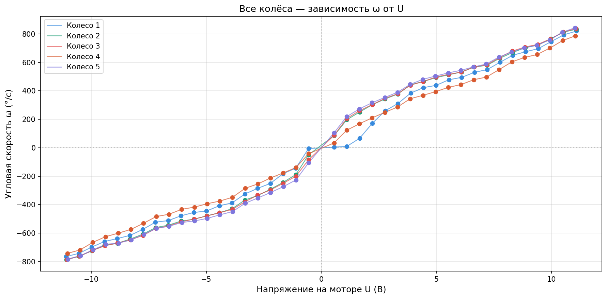

# Motor Parameters Identification

Tools for collecting and analyzing angular velocity data for TRIK robot RK370 motors depending on the supplied voltage (PWM).

The project consists of three scripts:

* `collect_data.py` collects raw data on the robot.
* `plot.py` plots characteristics for each wheel.
* `plot_omega.py` plots a comparative graph for all wheels.

## Table of Contents

* [Project Structure](https://www.google.com/search?q=%23project-structure)
* [Wheel Numbering](https://www.google.com/search?q=%23wheel-numbering)
* [Data Format](https://www.google.com/search?q=%23data-format)
* [Quick Start](https://www.google.com/search?q=%23quick-start)
* [Scripts](https://www.google.com/search?q=%23scripts)
* [Results](https://www.google.com/search?q=%23results)

## Project Structure

```
src/
├── collect_data.py        # Data collection (runs on the robot)
├── plot.py                 # Plots ω(U%) and U/ω for each wheel
├── plot_omega.py           # Combined plot ω(U) for all wheels
├── motor_graphs.png        # Output: graphs for each wheel
├── omega_all_wheels.png    # Output: comparative plot of all wheels
├── wheels.jpg               # Photo of the experimental setup
└── motor_data/              # Measurement results
    ├── wheel_N_battery.txt  # Battery voltage during test for wheel N
    └── wheel_N_v_<V>.txt    # Encoder position (deg) and time (ms) at PWM V%

```

## Wheel Numbering

Wheel IDs are assigned from left to right, starting from 1:

**1 -> 2 -> 3 -> 4**

Wheel **5** is a motor without a wheel. It is used to compare the characteristics of a loaded and an unloaded motor.

## Data Format

### `wheel_N_battery.txt`

Contains the battery voltage at the time of the experiment series:

```
battery_voltage_mv: 11.091765403747559

```

### `wheel_N_v_<V>.txt`

Contains the time series of the encoder position. Each line has the format `<angle_in_degrees> <time_in_ms>`; lines starting with `#` are header lines:

```
# wheel_id: 1
# voltage_percent: 10
# battery_voltage_mv: 11.091765403747559
# format: position_deg time_ms
0 0
1 102
3 305
...

```

## Quick Start

### Install Dependencies

```bash
pip install numpy matplotlib

```

### Run Visualization

```bash
cd src

# Graphs for each wheel -> motor_graphs.png
python plot.py

# Comparative plot for all wheels -> omega_all_wheels.png
python plot_omega.py

```

## Scripts

### collect_data.py - Data Collection on TRIK

Runs directly on the robot. The script iterates through PWM values from -100% to +100% in 5% steps, performing the following actions for each value:

1. Resets the encoder.
2. Applies voltage to the motor.
3. Records encoder readings to a file for 2 seconds at 5 ms intervals.
4. Turns off the motor and waits for 1 second.

Before running, set the parameters at the beginning of the file:

| Parameter | Description | Example |
| --- | --- | --- |
| `WHEEL_ID` | Wheel number | `1` |
| `MOTOR_PORT` | Controller motor port | `"M1"` |
| `ENCODER_PORT` | Controller encoder port | `"E1"` |
| `RUN_TIME` | Recording duration per voltage value, seconds | `2.0` |

### plot.py - Individual Wheel Graphs

Reads all files from `motor_data/`, calculates angular velocity ω (deg/s) as the slope of the linear region of the position plot (the last ~60% of data points over time), and plots the following for each wheel:

* **ω vs PWM (%)** - Scatter plot with linear approximation.
* **U/ω vs PWM (%)** - Histogram of the "volts per deg/s" coefficient with a horizontal mean line.

The output is saved to `motor_graphs.png`.

### plot_omega.py - Combined Plot

Plots ω as a function of the actual voltage U (V) for all wheels on a single graph. The actual voltage is calculated using the formula:

```
U = (PWM% / 100) * battery_voltage

```

The output is saved to `omega_all_wheels.png`.

## Results

### Motor Characteristics per Wheel


On the left is the angular velocity versus PWM with linear approximation (slope `k` in deg/s per 1% PWM); on the right is the U/ω coefficient, which ideally should remain constant. All wheels display a distinct drop in the coefficient around zero, indicating a dead zone effect at low voltages.

| Wheel | Slope k, deg/s per 1% PWM | Average U/ω, V*s/deg |
| --- | --- | --- |
| 1 | 8.44 | 0.02016 |
| 2 | 8.95 | 0.01069 |
| 3 | 8.99 | 0.01048 |
| 4 | 7.90 | 0.01289 |
| 5 (no wheel) | 9.02 | 0.01026 |

### Comparison of All Wheels



The graph illustrates the angular velocity dependence on the actual motor voltage (V) for all five wheels on shared axes. The curves generally align, and the S-curve near zero confirms the presence of a dead zone common to all motors.
